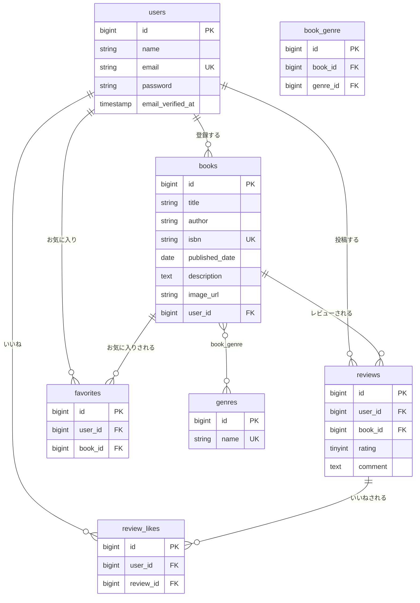

# BookShelf 書籍レビューアプリ

書籍の登録・レビュー投稿・お気に入り管理ができる書籍レビューアプリです。COACHTECH模擬案件として、要件定義書をもとにDB設計・認証/認可・CRUD実装・公開API実装・テスト作成までを一人で担当しました。

## 概要

ユーザーは書籍を登録し、他のユーザーが投稿した書籍に対してレビュー（評価・コメント）を投稿できます。気に入った書籍はお気に入り登録、参考になったレビューには「いいね」を付けることができ、レビュー平均評価に基づく書籍ランキングも表示されます。ジャンルによる書籍管理・絞り込みにも対応しています。

### 実装した機能

- 会員登録・ログイン・ログアウト（Laravel Fortify）
- 書籍のCRUD（登録・一覧・詳細・編集・削除）
- キーワード検索・ジャンル絞り込み・並び替え（新着順／古い順／タイトル順／評価順）
- レビューのCRUD（投稿・編集・削除）、レビューへの「いいね」
- お気に入り登録／解除
- ジャンル管理（登録・編集・削除、紐付く書籍がある場合は削除不可）
- レビュー平均評価によるランキング表示（TOP10）
- 認可制御（本人以外は書籍・レビューの編集/削除不可、403を返す）
- 公開API（書籍の一覧・詳細取得は認証不要、登録・更新・削除はSanctumトークン認証が必須）
- 単体テスト・機能テスト 計43本

## ER図



## 使用技術

| カテゴリ | 技術 |
|---|---|
| 言語 | PHP 8.5 |
| フレームワーク | Laravel 10.x |
| データベース | MySQL 8.4 |
| 認証 | Laravel Fortify（Web）／Laravel Sanctum（公開API） |
| フロントエンド | Blade, Tailwind CSS 3.4, Alpine.js, Vite |
| 開発環境 | Docker, Laravel Sail, phpMyAdmin |
| テスト | PHPUnit（Laravel標準） |

## 環境構築手順

Laravelに触ったことがない方でも動かせるよう、1ステップずつ詳しく説明します。上から順番に、飛ばさず実行してください。

### 事前準備：Docker Desktopのインストール

このプロジェクトは「Docker」という、PC上に隔離された実行環境（コンテナ）を作る仕組みの上で動きます。PHPやMySQLを個別にPCへインストールする必要はありません。

1. [Docker Desktop公式サイト](https://www.docker.com/products/docker-desktop/) からご自身のOS（Mac／Windows）に合ったものをダウンロードし、インストールしてください。
2. インストール後、Docker Desktopアプリを起動してください。画面左下（または該当箇所）のクジラのアイコンが動いていれば起動完了です。
3. ターミナル（Mac）またはコマンドプロンプト／PowerShell（Windows）を開き、以下を実行してバージョンが表示されればインストール成功です。

```bash
docker --version
```

### ステップ1：リポジトリをクローンする

「クローンする」とは、GitHub上にあるプロジェクトのファイル一式を、自分のPCにコピーしてくることです。

```bash
git clone git@github.com:sae0715/bookshelf-app.git
cd bookshelf-app
```

`cd bookshelf-app` は「これ以降のコマンドを、このプロジェクトフォルダの中で実行します」という意味です。この後の手順は、すべてこの `bookshelf-app` フォルダの中で行います。

### ステップ2：環境変数ファイル（.env）を準備する

`.env` ファイルには、データベースのパスワードなど「環境ごとに変わる設定」をまとめて書いておきます。テンプレートファイルをコピーして作成します。

```bash
cp .env.example .env
```

作成された `.env` ファイルをテキストエディタ（VSCodeなど）で開き、データベース関連の項目を以下のように設定してください（元から記載がある場合は書き換えてください）。

```
DB_CONNECTION=mysql
DB_HOST=mysql
DB_PORT=3306
DB_DATABASE=laravel
DB_USERNAME=sail
DB_PASSWORD=password
```

### ステップ3：Composerの依存パッケージをインストールする

「Composer」はPHPのライブラリ（他の人が作った便利な部品）を管理するツールです。このプロジェクトが使っているライブラリ一式をダウンロードします。まだ環境自体ができていないので、少し特殊な1行コマンドで実行します。

```bash
docker run --rm \
  -u "$(id -u):$(id -g)" \
  -v "$(pwd):/var/www/html" \
  -w /var/www/html \
  laravelsail/php82-composer:latest \
  composer install --ignore-platform-reqs
```

実行すると、ズラズラとダウンロードのログが流れます。数十秒〜数分かかります。最後に `Generating optimized autoload files` のような表示が出れば完了です。このコマンドの後、プロジェクトフォルダの中に `vendor` という新しいフォルダができているはずです。

### ステップ4：Laravel Sailを起動する

「Sail」は、このプロジェクトに必要な複数のコンテナ（PHPを動かす箱、MySQLを動かす箱など）をまとめて起動・管理してくれる仕組みです。

```bash
./vendor/bin/sail up -d
```

初回は各コンテナのイメージ（設計図）のダウンロードが走るため、数分かかることがあります。`-d` は「バックグラウンドで起動する」という意味で、これを付けるとターミナルの操作がすぐ返ってきます。

以降、コマンドの先頭を `./vendor/bin/sail` の代わりに単に `sail` と打てるようにするため、エイリアス（ショートカット）を登録しておくと便利です（任意ですが推奨します）。

```bash
echo "alias sail='[ -f sail ] && bash sail || bash vendor/bin/sail'" >> ~/.zshrc
exec $SHELL
```

（Windowsの場合や `zsh` 以外をお使いの場合は、以降のコマンドの `sail` を `./vendor/bin/sail` に読み替えて実行してください。）

**起動確認**：Docker Desktopのアプリを開き、コンテナが3〜4個（`laravel.test`、`mysql`、`phpmyadmin` など）起動中（緑色）になっていればOKです。

### ステップ5：アプリケーションキーを生成する

Laravelがデータの暗号化などに使う秘密鍵を生成します。

```bash
sail artisan key:generate
```

`.env` ファイルの `APP_KEY=` の後ろに文字列が入っていれば成功です。

### ステップ6：フロントエンドの依存パッケージを復元する

`package.json`（必要なパッケージの一覧が書かれたファイル）と `tailwind.config.js`（デザイン設定ファイル）はリポジトリに含まれているため、新規作成の必要はありません。以下のコマンドで、記載されているパッケージ一式をまとめて復元します。

```bash
sail npm install
```

数十秒〜1分程度かかります。エラーが出ずに元のコマンド入力状態（プロンプト）に戻れば成功です。この時点で `node_modules` フォルダが作成されます。

### ステップ7：データベースを作成する（マイグレーション・シーディング）

「マイグレーション」はデータベースにテーブル（表）を作る作業、「シーディング」はそのテーブルにテスト用のサンプルデータを入れる作業です。以下の1コマンドでまとめて実行します。

```bash
sail artisan migrate:fresh --seed
```

テーブル名が並んだログが表示され、エラーなく終われば成功です。この時点で、書籍・ジャンル・レビューなどのサンプルデータが入った状態になります。

### ステップ8：Viteを起動する（開発サーバー）

さきほど準備したTailwind CSSなどを、実際に画面へ反映させ続けるためのコマンドです。**このコマンドは実行したまま、ターミナルを閉じずに待機させておく必要があります。**

```bash
sail npm run dev
```

`VITE ready` のような表示が出て、コマンド入力が返ってこない状態（動きっぱなしの状態）になれば成功です。以降、別の作業をする場合は**新しいターミナルのタブ／ウィンドウ**を開いて行ってください。

### ステップ9：動作確認

ブラウザで以下のURLを開いてください。

- Webアプリ: [http://localhost](http://localhost)
- phpMyAdmin（データベース確認用）: [http://localhost:8080](http://localhost:8080)（ユーザー名 `sail` / パスワード `password`）

書籍一覧画面が表示されれば、環境構築は完了です。

### うまく表示されないときは

- **画面のデザインが崩れている（無装飾のまま）**：ステップ8の `sail npm run dev` が起動したままになっているか確認してください。
- **真っ白な画面になる**：`sail artisan route:clear` と `sail artisan config:clear` を実行してから再度アクセスしてみてください。
- **データベース関連のエラーが出る**：`.env` のDB設定（ステップ2）が正しいか、`sail artisan migrate:fresh --seed`（ステップ7）が正常に完了しているか確認してください。

## 開発環境URL

- Webアプリ: http://localhost
- phpMyAdmin: http://localhost:8080
- 公開API: http://localhost/api/v1

## テスト用アカウント

シーディングにより、以下のテストユーザーが作成されます（パスワード共通: `password`）。

| メールアドレス | 名前 |
|---|---|
| yamada@example.com | 山田太郎 |
| suzuki@example.com | 鈴木花子 |
| tanaka@example.com | 田中一郎 |
| sato@example.com | 佐藤美咲 |
| takahashi@example.com | 高橋健太 |

会員登録画面から新規にアカウントを作成することも可能です。

## APIエンドポイント一覧

| メソッド | パス | 概要 | 認証 |
|---|---|---|---|
| GET | /api/v1/books | 書籍一覧取得（キーワード検索・ジャンル絞り込み・ページネーション対応） | 不要 |
| GET | /api/v1/books/{id} | 書籍詳細取得（ジャンル・レビュー情報を含む） | 不要 |
| POST | /api/v1/books | 書籍新規登録 | 必須（Sanctum） |
| PUT | /api/v1/books/{id} | 書籍更新（本人以外は403） | 必須（Sanctum） |
| DELETE | /api/v1/books/{id} | 書籍削除（本人以外は403） | 必須（Sanctum） |

## テスト実行方法

```bash
sail artisan test
```

## 作成者

稲嶺 紗絵子