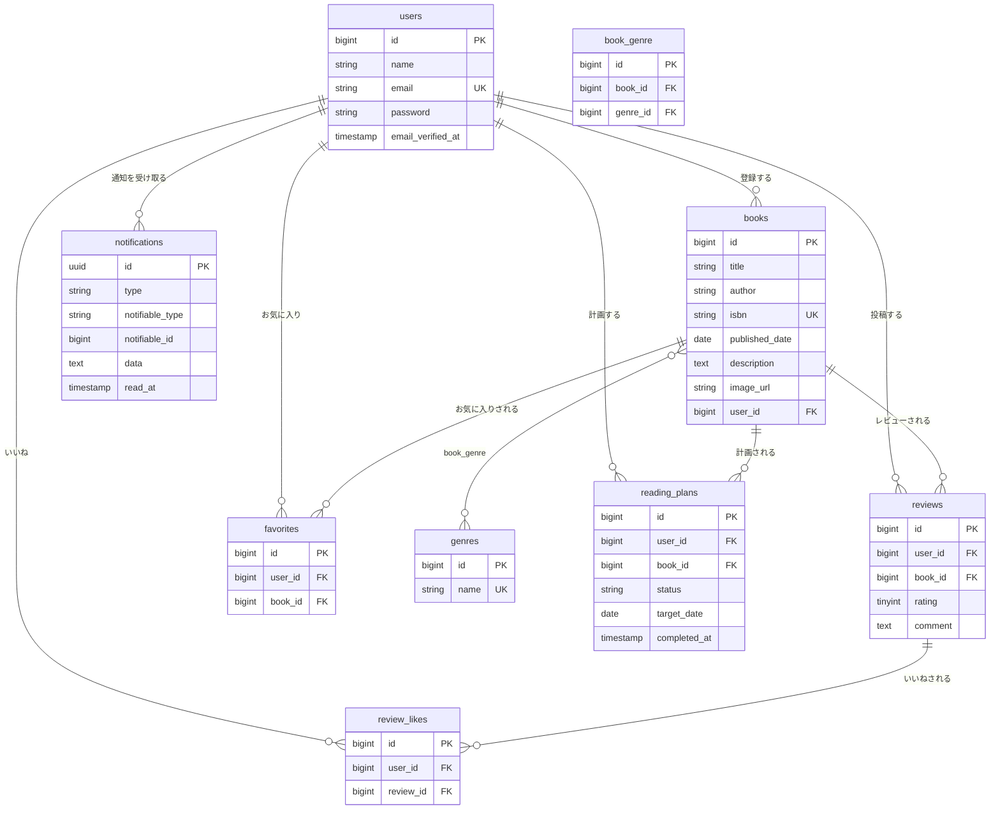

# BookShelf 書籍レビューアプリ

書籍の登録・レビュー投稿・お気に入り管理ができる書籍レビューアプリです。COACHTECH模擬案件として、要件定義書をもとにDB設計・認証/認可・CRUD実装・公開API実装・テスト作成までを一人で担当しました。

## 概要

ユーザーは書籍を登録し、他のユーザーが投稿した書籍に対してレビュー（評価・コメント）を投稿できます。気に入った書籍はお気に入り登録、参考になったレビューには「いいね」を付けることができ、レビュー平均評価に基づく書籍ランキングも表示されます。ジャンルによる書籍管理・絞り込みにも対応しています。

### 実装した機能

#### 基本機能

- 会員登録・ログイン・ログアウト（Laravel Fortify）
- 書籍のCRUD（登録・一覧・詳細・編集・削除）
- キーワード検索・ジャンル絞り込み・並び替え（新着順／古い順／タイトル順／評価順）
- レビューのCRUD（投稿・編集・削除）、レビューへの「いいね」
- お気に入り登録／解除
- ジャンル管理（登録・編集・削除、紐付く書籍がある場合は削除不可）
- レビュー平均評価によるランキング表示（TOP10）
- 認可制御（本人以外は書籍・レビューの編集/削除不可、403を返す）
- 公開API（書籍の一覧・詳細取得は認証不要、登録・更新・削除はSanctumトークン認証が必須）

#### 応用機能

- **ISBN検索**：13桁のISBNを入力すると、Google Books APIから書籍情報（タイトル・著者・出版日・説明・画像）を取得してフォームに自動入力
- **読書計画**：書籍ごとに「進行中／完了／期限切れ」のステータスで読書計画を管理
  - 1ユーザー・1書籍につき「進行中」の計画は1件までに制限（重複制御）
  - 「完了」になった計画は編集不可（削除・読了の取り消しのみ可能）。「期限切れ」の計画は編集・読了操作を継続可能
  - 誤って「読了」にした場合の取り消し機能
- **マイ読書レポート**：総レビュー数・読了冊数（レビュー投稿済みのユニーク書籍数）・平均評価などの基本サマリー、評価分布、高評価書籍TOP5、ジャンル別評価傾向TOP5を集計表示
- **通知バッチ**：読書計画の期日3日前・当日・期限切れ3日後にリマインダー通知（Laravel Notification）、期日を過ぎた計画の自動失効を、毎日20:00の日次バッチ（Schedule + Console Command）で実行

単体テスト・機能テスト 計78本

## ER図



## 使用技術

| カテゴリ | 技術 |
|---|---|
| 言語 | PHP 8.5 |
| フレームワーク | Laravel 10.x |
| データベース | MySQL 8.4 |
| 認証 | Laravel Fortify（Web）／Laravel Sanctum（公開API） |
| フロントエンド | Blade, Tailwind CSS 3.4, Alpine.js, Vite |
| 開発環境 | Docker, Laravel Sail, phpMyAdmin |
| テスト | PHPUnit（Laravel標準） |

## 環境構築手順

以下の手順で動作します。上から順に実行してください。

### 事前準備：Docker Desktop

[Docker Desktop公式サイト](https://www.docker.com/products/docker-desktop/)からインストールし、起動してください。

```bash
docker --version
```

バージョンが表示されればOKです。

### ステップ1：リポジトリをクローン

```bash
git clone git@github.com:sae0715/bookshelf-app.git
cd bookshelf-app
```

以降のコマンドはすべて `bookshelf-app` フォルダ内で実行します。

### ステップ2：環境変数（.env）の設定

```bash
cp .env.example .env
```

`.env`を開き、以下を設定してください（既存の記載があれば上書き）。

```
DB_CONNECTION=mysql
DB_HOST=mysql
DB_PORT=3306
DB_DATABASE=laravel
DB_USERNAME=sail
DB_PASSWORD=password
```

ISBN検索機能（応用機能）用に、`.env`に以下のキーも追加してください。

```
GOOGLE_BOOKS_API_KEY=
```

※このキーが空のままだと、Google Books API側の利用制限により正常に動作しない場合があります。[Google Cloud Console](https://console.cloud.google.com/)でBooks APIを有効化し、ご自身のAPIキーを取得の上、上記の`GOOGLE_BOOKS_API_KEY=`の後ろに貼り付けてください。（無料・5分程度で取得可能です）

**APIキー取得手順**：
1. [Google Cloud Console](https://console.cloud.google.com/)にアクセスし、Googleアカウントでログイン
2. 新しいプロジェクトを作成（名前は任意）
3. 「APIとサービス」→「ライブラリ」から「Books API」を検索し、有効化
4. 「APIとサービス」→「認証情報」→「認証情報を作成」→「APIキー」でキーを発行
5. 発行されたキー（`AIzaSy...`で始まる文字列）を`.env`に貼り付け


### ステップ3：Composerパッケージのインストール

`vendor`フォルダがまだ無い状態のため、一時的にComposerコンテナを立てて実行します。

```bash
docker run --rm \
  -u "$(id -u):$(id -g)" \
  -v "$(pwd):/var/www/html" \
  -w /var/www/html \
  laravelsail/php82-composer:latest \
  composer install --ignore-platform-reqs
```

`vendor`フォルダが作成されていれば成功です。

### ステップ4：Sailを起動

```bash
./vendor/bin/sail up -d
```

ocker Desktopでコンテナ（`laravel.test`・`mysql`・`phpmyadmin`）が起動中（緑）になっていれば成功です。

**エイリアスの設定（任意）**：

以降`sail`コマンドを使う場合は、エイリアスを設定すると便利です。

```bash
echo "alias sail='[ -f sail ] && bash sail || bash vendor/bin/sail'" >> ~/.zshrc
exec $SHELL
```

※このコマンドは実行しても画面に何も表示されません（エラーが無ければ成功です）。設定できたか不安な場合は、以下で確認してください。

```bash
sail artisan --version
```

Laravelのバージョンが表示されれば成功です。
`command not found: sail` と出た場合は、以降のコマンドの`sail`を`./vendor/bin/sail`に読み替えて実行してください。

（`zsh`以外の場合はこのエイリアス設定自体が効かないため、同様に`./vendor/bin/sail`を使ってください。WindowsでWSLを使っている場合は、WSL上のシェルの種類によります）

### ステップ5：アプリケーションキーの生成

```bash
sail artisan key:generate
```

### ステップ6：フロントエンド依存パッケージの復元

```bash
sail npm install
```

`node_modules`フォルダが作成されていれば成功です。
`vulnerabilities`（脆弱性）の件数表示や、npmの新バージョン案内が出ることがありますが、いずれもエラーではないため無視して問題ありません。
`npm ERR!`という文字列が出ていなければ正常に完了しています。

### ステップ7：DBのマイグレーション・シーディング

```bash
sail artisan migrate:fresh --seed
```

すべてのマイグレーション・Seederの行に`DONE`と表示されていれば成功です。`Seeding database.`の下に`ReadingPlanSeeder`まで含めて全7個のSeederが並んでいるか確認してください。

### ステップ8：Viteの起動

```bash
sail npm run dev
```

このコマンドは実行したまま待機させてください。別作業は新しいターミナルで行ってください。

### ステップ9：動作確認

- Webアプリ: http://localhost
- phpMyAdmin: http://localhost:8080 （ユーザー名 `sail` / パスワード `password`）

書籍一覧が表示されれば完了です。

### うまく表示されないときは

- **画面が崩れている**：`sail npm run dev`が起動しているか確認
- **真っ白な画面**：`sail artisan route:clear` と `sail artisan config:clear` を実行
- **DB関連のエラー**：`.env`のDB設定と`sail artisan migrate:fresh --seed`が正常に完了しているか確認
- **phpMyAdminで「Access denied for user 'root'」と表示される**：`sail up -d`（ステップ4）を実行した後に`.env`のDB設定を変更した場合に起こります。
コンテナが古い設定を読み込んだままになっているため、以下を実行して再起動してください。

```bash
sail down
sail up -d
```

## 開発環境URL

- Webアプリ: http://localhost
- phpMyAdmin: http://localhost:8080
- 公開API: http://localhost/api/v1
（※ブラウザで直接開いても404になります。個別のエンドポイントは下記「APIエンドポイント一覧」を参照してください。例: http://localhost/api/v1/books ）

## テスト用アカウント

シーディングにより、以下のテストユーザーが作成されます。

| メールアドレス | 名前 |
|---|---|
| yamada@example.com | 山田太郎 |
| suzuki@example.com | 鈴木花子 |
| tanaka@example.com | 田中一郎 |
| sato@example.com | 佐藤美咲 |
| takahashi@example.com | 高橋健太 |

パスワード共通: `password`

会員登録画面から新規にアカウントを作成することも可能です。

## APIエンドポイント一覧

| メソッド | パス | 概要 | 認証 | 成功時 | 主なエラー |
|---|---|---|---|---|---|
| GET | /api/v1/books | 書籍一覧取得（キーワード検索・ジャンル絞り込み・ページネーション対応、20件/ページ） | 不要 | 200 | - |
| GET | /api/v1/books/{id} | 書籍詳細取得（ジャンル・レビュー情報を含む） | 不要 | 200 | 404（未存在） |
| POST | /api/v1/books | 書籍新規登録 | 必須（Sanctum） | 201 | 422（バリデーションエラー） |
| PUT | /api/v1/books/{id} | 書籍更新（本人以外は403） | 必須（Sanctum） | 200 | 404（未存在）／403（本人以外） |
| DELETE | /api/v1/books/{id} | 書籍削除（本人以外は403） | 必須（Sanctum） | 204 | 404（未存在）／403（本人以外） |

## 読書計画の日次バッチ

読書計画のリマインダー通知（期日3日前・当日・期限切れ3日後）と自動失効は、毎日20:00に実行される日次バッチで処理されます（`app/Console/Kernel.php`にスケジュール登録済み）。

ローカル環境で動作確認したい場合は、以下のコマンドで手動実行できます。

```bash
sail artisan reading-plans:process
```

## テスト実行方法

```bash
sail artisan test
```

## 作成者
稲嶺 紗絵子